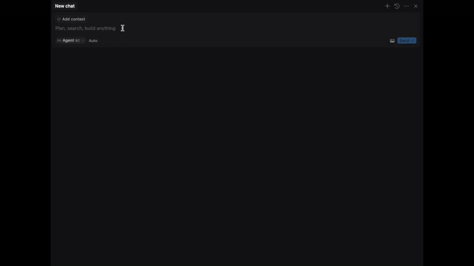

# CS2 RCON MCP

[](https://www.python.org/downloads/)
[](https://cursor.sh)
[](https://opensource.org/licenses/MIT)

A Model Context Protocol server for CS2 RCON management.

## Description

This project provides a Model Context Protocol (MCP) server interface for managing CS2 game servers via RCON. It allows remote control and monitoring of CS2 servers through a standardized protocol.



## Features

- Manage your CS2 server in natural language
- RCON command execution
- Server status monitoring
- SSE-based communication
- Docker support

## Installation

```bash
pip install -e .
```

## Usage

### Running the Server

```bash
python -m rcon_mcp
```

### Available Commands

- `rcon <command>`: Execute any RCON command
- `status`: Get current server status
- `changelevel <map_name>`: Change the current map
- `mp_warmup_end`: End the warmup phase
- `mp_restartgame 1`: Restart the game
- And many more CS2 server commands

## Environment Variables

- `HOST`: CS2 server IP
- `SERVER_PORT`: CS2 server port
- `RCON_PASSWORD`: RCON password

## Docker (recommended)

Pull and run the Docker image from GitHub Container Registry:

```bash
docker pull ghcr.io/v9rt3x/cs2-rcon-mcp:main
docker run -p 8080:8080 ghcr.io/v9rt3x/cs2-rcon-mcp:main
```

### Docker Environment Variables

When running with Docker, you can set the environment variables:

```bash
docker run -p 8080:8080 \
  -e HOST=your_server_ip \
  -e SERVER_PORT=your_server_port \
  -e RCON_PASSWORD=your_password \
  ghcr.io/v9rt3x/cs2-rcon-mcp:main
```

### Connecting from Cursor (or any other MCP-Client)

1. Start the MCP server (either directly or via Docker)
2. Configure Cursor's MCP settings by creating or updating `~/.cursor/mcp.json`:
   ```json
   {
     "mcpServers": {
       "cs2server": {
         "url": "http://localhost:8080/cs2server/sse"
       }
     }
   }
   ```
3. In Cursor, open the MCP panel (usually in the sidebar)
4. The server should automatically connect using the configured URL

Once connected, you can manage your server in natural language.

Example prompts:

1. "Add 5 bots to the server and start a competitive match on de_dust2"
2. "What's the current server status? How many players are connected and what map are we on?"

Happy fragging! 😊
